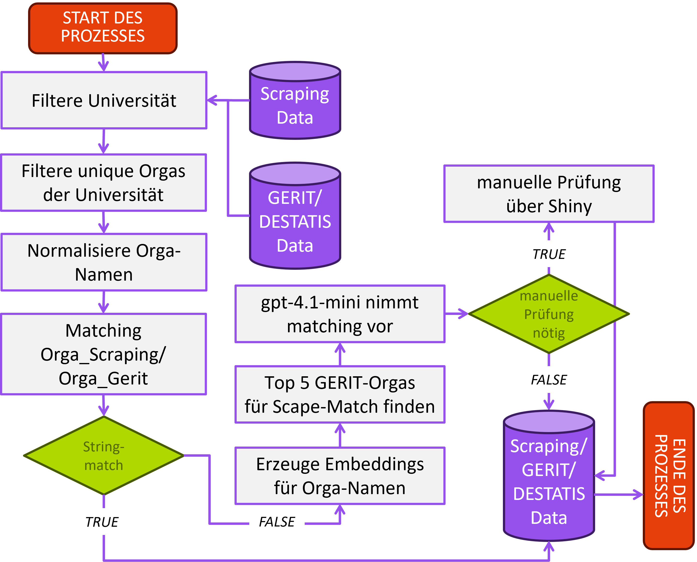

# HEXmatchR <a href="http://srv-data01:30080/hex/HEXmatchR"></a>

`HEXmatchR` matched Organisationsnamen einer Universität der HEX-Scraping-Daten gegen die der entsprechenden
GERIT-Organisationsnamen. Ziel des Matching ist es, Fachgebiete, Fächergruppen und Lehr- und Forschungsbereiche zu identifizieren und so DESTATIS-Metadaten (Studierendenzahlen, Lehrendenzahlen usw.) mit den HEX-Daten verbinden zu können.

Kern des Matchingprozesses ist der Wrapper `run_matching_workflow()`.
Diese README beschreibt im folgenden, was in
`run_matching_workflow()` passiert: welche Daten hineingehen, wie
Entscheidungen entstehen, wann OpenAI genutzt wird, was automatisch passiert, was manuell geprueft wird und welche Ergebnisse herauskommen.

## Wie funktioniert HEXmatchR?

`HEXmatchR` stellt für die Nutzer einen simplen Wrapper namens `run_matching_workflow` bereit. 


## Voraussetzungen für HEXmatchR

Der Workflow braucht drei Dinge:

1. Scraping Daten inkl. der Variable `organisation`: Die gescrapten Daten finden sich standardmäßig auf dem Sharepoint. Der Matchingprozess setzt - da er auf dem Cleaning aufbaut - eine möglichst saubere  `organisation`-Variable voraus.

2. Die `db_data.rds` einer Hochschule, um ggf. bereits gemachte Organisationen zu übernehmen.  

3. Gerit-Destatis-Daten: Weiterhin werden die Gerit-Destatis-Daten benötigt: `data/GERIT_DESTATIS_data.rds`. In ihnen befinden sich die Schlüsselvariable `Gerit_Orga`, die mit `organisation` aus den Scraping-Daten gemacht werden soll. Die Daten finden sich ebenfalls [hier](https://stifterverband.sharepoint.com/:f:/s/Dateiablage/IgBLB0wObx8uS6GhlQhnGBF-AdbXQxH89shU8m53tvxLau0?e=WXroR1).

## Schnellstart von HEXmatchR

Das matching kann durch einen einfachen Wrapper angestoßen werden: 

```r
workflow_result <- run_matching_workflow(
  name_gerit = "Johann Wolfgang Goethe-Universität Frankfurt am Main",
  df_scraped = df_sample,
  gold_data = "data/db_data_universitaet_fam.rds", 
  output_dir = "matching-output-sample"
)
```

Der Prozess läuft in folgenden Schritten ab:

1. GERIT-Daten filtern – Die Daten werden jeweils auf die entsprechende Hochschule gefiltert.
2. Unique Organisationen identifizieren – Aus den Scraping- und GERIT-Daten werden die eindeutigen Organisationsnamen extrahiert.
3. Namen normalisieren – Die Organisationsnamen werden vereinheitlicht.
4. Matching – Das Matching erfolgt in zwei Stufen:
   - 4.1 String-Match – Wo möglich, wird ein direkter Zeichenkettenvergleich durchgeführt.
   - 4.2 Embedding-basiertes Matching – Schlägt der String-Match fehl, wird wie folgt vorgegangen:
     1. Embeddings für Scraping- und GERIT-Organisationen werden erzeugt.
     2. Auf dieser Basis werden die fünf ähnlichsten Matching-Partner ermittelt.
     3. `gpt-4.1` wählt den besten Match aus den Top-5-Kandidaten.
     4. Ist sich `gpt-4.1` unsicher, werden die betreffenden Fälle manuell über eine Shiny-App anhand der Top-5-Kandidaten durch einen Menschen gematcht.

Das folgende Diagramm visualisiert den Gesamtprozess:



## Installation

`HEXmatchR` kann simpel direkt von GitHub aus installiert werden:

```r
remotes::install_github("Stifterverband/HEXmatchR")
```
