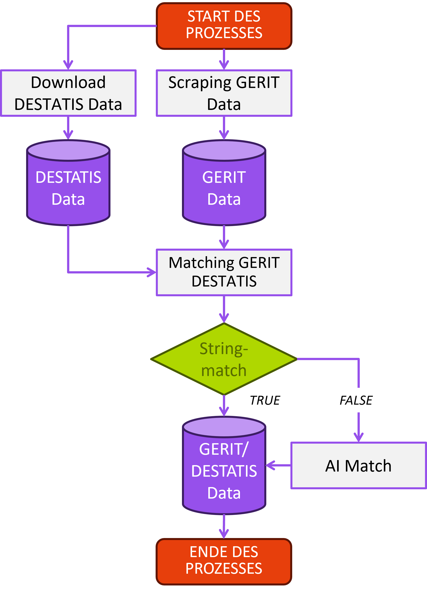
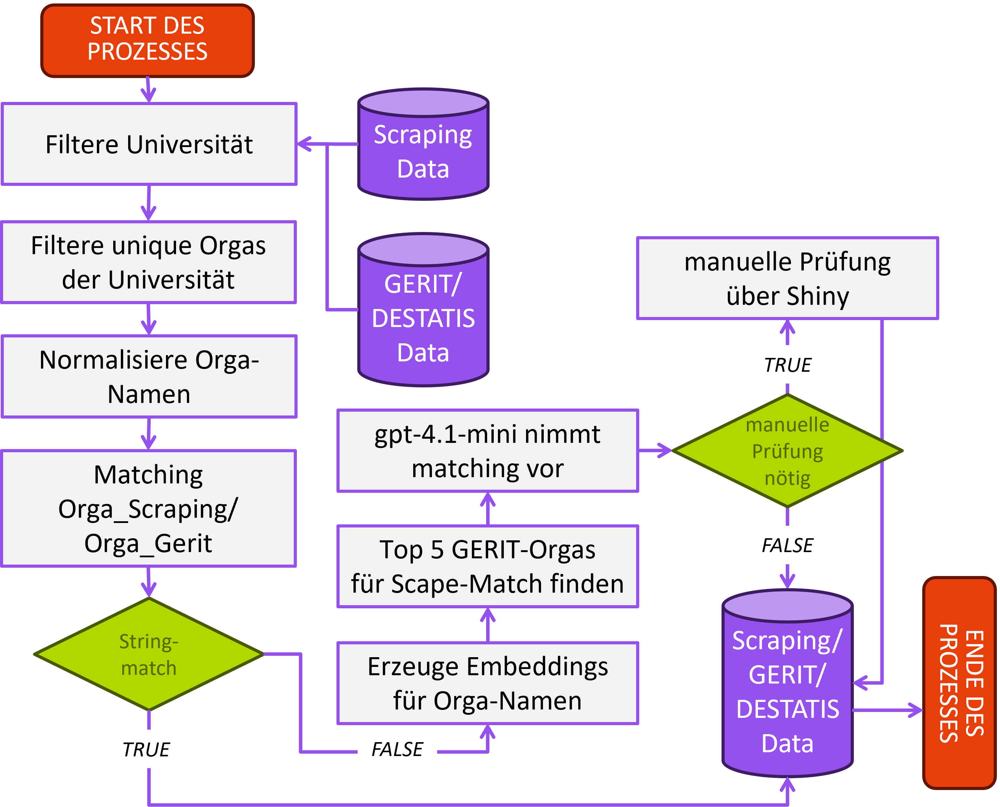
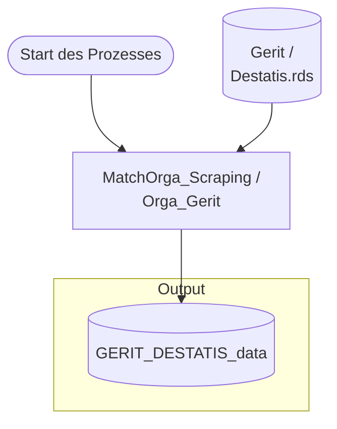

# Matching Prozess

## Voraussetzungen

Um das Matching der Scraping-Daten mit denen von [GERIT](https://www.gerit.org/de/) gewährleisten zu können, müssen in einem ersten Schritt die Daten von GERIT gescrapt werden.

Dies geschieht mit: TODO

Weiterhin müssen die [DESTATIS](https://erhebungsportal.estatistik.de/Erhebungsportal/informationen/statistik-des-hochschulpersonals-670)-Daten heruntergeladen werden. Diese können hier gefunden werden: TODO

Liegen die Daten vor, werden sie zusammengespielt. Da ein direkter String-Match der Lehr- und Forschungsbereiche nicht immer möglich ist, wird auch hier auf den AI-Match-Workflow zurückgegriffen. Dies erspart uns das jährliche Anpassen von Regex-Patterns beim Matching und harmonisiert so den Workflow.

Folgende Grafik illustriert den Workflow:




## Matching - Der Prozess Schritt für Schritt



### 1. Nutzer und Eingabedaten vorbereiten

Der Workflow ermittelt zuerst den aktuellen Nutzernamen ueber `current_username()`. Dafuer werden die Umgebungsvariablen `USERNAME`, `USER` und `LOGNAME` geprueft. Der Name landet spaeter in Dateinamen und Metadaten.

`df_scraped` wird in ein Tibble umgewandelt. Die eigentliche Matching-Spalte wird spaeter in `organisation` umbenannt, egal wie sie urspruenglich hiess, solange `organisation_col` korrekt gesetzt ist.

### 2. GERIT-DESTATIS-Daten fuer eine Hochschule laden

`prepare_gerit_data(name_gerit)` liest standardmaessig:

``` text
data/GERIT_DESTATIS_data.rds
```

Dabei passiert Folgendes:

-   Die Datei wird geladen und in ein Tibble umgewandelt.
-   Falls noetig, werden alte bzw. alternative Spaltennamen vereinheitlicht: `Hochschul_Name` wird zu `HS`, `Gerit_Orga` wird zu `Einrichtung`.
-   Fehlende optionale Spalten werden mit `NA` angelegt, zum Beispiel `Fachgebiet_Gerit_1` bis `Fachgebiet_Gerit_6`, `Faechergruppen_IDs` und `LUF_Namen`.
-   Pflichtspalten werden geprueft: `HS` und `Einrichtung`.
-   `name_gerit` muss exakt in `HS` vorkommen. Wenn nicht, gibt die Funktion alle erlaubten Hochschulnamen aus und bricht ab.
-   Die GERIT-Tabelle wird auf genau diese Hochschule gefiltert.
-   Eine `gerit_ID` wird erzeugt oder vorhandene IDs werden als Integer aufbereitet.
-   `gerit_cleaned` wird als normalisierte Variante von `Einrichtung` erzeugt.
-   `unique_name_for_einrichtung` markiert, ob ein Einrichtungsname innerhalb der Hochschule eindeutig ist.

Diese gefilterte GERIT-Tabelle ist die Referenzmenge fuer alle folgenden Schritte.

### 3. Gescrapte Organisationen extrahieren

[`extract_scraped_organisations()`](https://github.com/Stifterverband/HEXmatchR/reference/extract_scraped_organisations.md) arbeitet auf `df_scraped` und erzeugt eine Organisationstabelle auf eindeutiger Organisations-Ebene.

Dabei passiert Folgendes:

-   Spaltennamen werden kleingeschrieben.
-   Die konfigurierte Organisationsspalte wird intern `organisation` genannt.
-   Alle Organisationswerte werden als Text behandelt.
-   Semikolon-getrennte Mehrfachnennungen werden zerlegt. Aus `"Institut A; Institut B"` werden zwei Organisationen.
-   Leere oder fehlende Organisationsstuecke werden entfernt.
-   Identische Organisationsnamen werden dedupliziert.
-   Fuer jede Organisation wird gespeichert, aus welchen urspruenglichen Organisationsstrings sie kam. Diese Rueckverknuepfung steht in `organisation_names_for_matching_back`.
-   `organisation_original` enthaelt den Originalwert.
-   `cleaned` enthaelt eine normalisierte Textfassung.
-   Alle Matching-Spalten werden leer initialisiert.
-   Jede eindeutige Organisation bekommt eine laufende `scraped_ID`.

Die Normalisierung in `normalize_text()` ist bewusst einfach und transparent:

-   Text wird nach ASCII transliteriert.
-   Alles wird kleingeschrieben.
-   Klammern werden durch Leerzeichen ersetzt.
-   `&` wird zu `und`.
-   haeufige Strukturbegriffe wie `Institut`, `Professur`, `Department`, `Fachbereich`, `Seminar`, `Klinik`, `Abteilung`, `Lehrstuhl`, `Arbeitsgruppe`, `Zentrum`, `Arbeitsstelle` und `Chair` werden entfernt.
-   `fur` wird entfernt.
-   Nicht-alphanumerische Zeichen werden durch Leerzeichen ersetzt.
-   Mehrfache Leerzeichen werden bereinigt.

Beispielhaft kann aus:

``` text
Institut fuer Wirtschaftsinformatik (Lehrstuhl A)
```

ungefaehr werden:

``` text
wirtschaftsinformatik a
```

### 4. Deterministisches Matching

`apply_deterministic_matches()` versucht zuerst sichere automatische Treffer, bevor Embeddings oder ein LLM genutzt werden.

Es gibt zwei deterministische Match-Typen:

-   `direct`: Der rohe Organisationsname entspricht exakt einem eindeutigen GERIT-`Einrichtung`-Wert.
-   `cleaned`: Der normalisierte Organisationsname entspricht exakt einem eindeutigen `gerit_cleaned`-Wert.

Wichtig fuer die Transparenz: Es werden nur eindeutige GERIT-Treffer automatisch uebernommen. Wenn derselbe GERIT-Name mehrfach vorkommt, wird er nicht deterministisch gematcht. Dadurch werden schnelle, aber riskante Mehrdeutigkeiten vermieden.

Bei einem deterministischen Treffer werden die GERIT-Informationen direkt in die Match-Spalten geschrieben:

-   `gerit_ID`
-   `gerit_organisation`
-   `gerit_cleaned`
-   `Fachgebiet_Gerit_1` bis `Fachgebiet_Gerit_6`
-   `Faechergruppen`
-   `Faechergruppen_IDs`
-   `LUF_IDs`
-   `LUF_Namen`
-   `matched = "yes"`
-   `match_type = "direct"` oder `"cleaned"`
-   `match_confidence = 1`
-   `match_reason = "Deterministic ... match."`
-   `needs_review = FALSE`

### 5. Embedding-Kandidaten erzeugen

Alle Organisationen, die nach dem deterministischen Schritt noch `matched == "no"` sind, gehen in [`generate_embedding_candidates()`](https://github.com/Stifterverband/HEXmatchR/reference/generate_embedding_candidates.md).

Dieser Schritt erzeugt noch keine finale Entscheidung. Er erzeugt nur eine gerankte Kandidatenliste fuer das LLM.

So funktioniert es:

-   Als GERIT-Kandidaten werden nur Eintraege genutzt, deren `unique_name_for_einrichtung == "ja"` ist.
-   Fuer jeden offenen Scraping-Wert wird ein Embedding-Text gebaut. In der Praxis ist das der rohe Organisationsname, mit Fallback auf `cleaned`.
-   Fuer jeden GERIT-Kandidaten wird der Einrichtungsname als Embedding-Text genutzt.
-   Beide Textmengen werden mit dem OpenAI Embedding-Modell eingebettet, standardmaessig `text-embedding-3-large`.
-   Fuer jede offene Organisation wird die Kosinusaehnlichkeit zu allen GERIT-Kandidaten berechnet.
-   Die besten `top_k` Kandidaten werden behalten, standardmaessig 5.
-   Bei Score-Gleichstand wird stabil nach `Einrichtung` sortiert.

Der Output dieses Schritts hat unter anderem:

-   `scraped_ID`
-   `organisation`
-   `cleaned`
-   `gerit_ID`
-   `Einrichtung`
-   `score`
-   `candidate_rank`
-   `candidate_source = "embedding"`

Der `score` ist eine Kosinusaehnlichkeit der Embeddings. Er ist nur ein Ranking-Signal. Er ist keine kalibrierte Wahrscheinlichkeit und nicht die finale Match-Entscheidung.

GERIT-Embeddings werden standardmaessig lokal gecacht:

``` text
data/cache/gerit_embeddings_<embedding_model>.rds
```

Der Cache speichert Kombinationen aus Modellname, Eingabetext und Embedding. Bereits vorhandene GERIT-Embeddings werden wiederverwendet. Query-Embeddings der gescrapten Organisationen werden absichtlich nicht dauerhaft gecacht, weil sie laufabhaengig sind.

### 6. LLM-Entscheidung

[`match_organisations_with_llm()`](https://github.com/Stifterverband/HEXmatchR/reference/match_organisations_with_llm.md) verarbeitet nur noch offene Organisationen. Deterministische Matches werden nicht erneut an das LLM geschickt.

Fuer jede offene Organisation sieht das LLM:

-   den Organisationsnamen
-   den bereinigten Organisationsnamen
-   optional `no_courses`, falls diese Spalte vorhanden ist
-   die `top_k` GERIT-Kandidaten aus dem Embedding-Schritt
-   pro Kandidat die `gerit_ID`, den Namen `Einrichtung` und den `embedding_score`

Das LLM darf nur eine von zwei Entscheidungen treffen:

-   `select_candidate`
-   `no_match`

Bei `select_candidate` muss `selected_candidate_id` exakt eine der erlaubten `gerit_ID`s aus der Kandidatenliste sein. Jede andere ID ist ungueltig und wird als Review-Fall behandelt.

Die Antwort wird strukturiert abgefragt. Erwartet werden:

-   `decision`
-   `selected_candidate_id`
-   `confidence`
-   `reason`
-   `needs_review`

Die Pipeline nutzt standardmaessig:

-   Chat-Modell: `gpt-4.1-mini`
-   Temperatur: `0`
-   Review-Schwelle: `review_confidence = 0.65`

Die Konfidenz ist die Selbsteinschaetzung des Modells zwischen 0 und 1. Sie wird so interpretiert:

-   Wenn `confidence < review_confidence`, wird `needs_review = TRUE`.
-   Wenn `confidence` fehlt, wird ebenfalls Review gesetzt.
-   Das vom Modell gelieferte `needs_review` wird eingelesen, praktisch entscheidend ist aber mindestens die Schwellenwertlogik.

Wenn das LLM `select_candidate` waehlt und die ID gueltig ist, werden die GERIT-Daten ueber `lookup_match_from_gerit()` in die Match-Spalten uebernommen:

-   `matched = "yes"`
-   `match_type = "llm"`
-   `match_confidence = confidence`
-   `match_reason = reason`
-   `needs_review` je nach Review-Logik

Wenn das LLM `no_match` waehlt, erzeugt `not_match_record()` einen leeren Match-Datensatz:

-   alle GERIT-Felder werden `NA`
-   `matched = "no"`
-   `match_type = "review"` wenn Review noetig ist
-   sonst `match_type = "not_matchable"`
-   `match_confidence = NA`
-   `match_reason = reason`

Wenn fuer eine Organisation keine Embedding-Kandidaten erzeugt wurden, wird automatisch `no_match` mit Review gesetzt.

### 7. Automatischer Zwischenstand

Nach Deterministik, Embeddings und LLM entsteht eine Tabelle auf Organisationsebene:

``` r

match_result$organisation_matches
```

Ausserdem gibt es:

``` r

match_result$candidates
match_result$llm_decisions
match_result$df_scraped_matched
```

`df_scraped_matched` ist bereits auf die urspruenglichen Scraping-Zeilen zurueckgespielt, aber noch vor einem optionalen manuellen Review.

### 8. Optionaler manueller Review

[`run_matching_workflow()`](https://github.com/Stifterverband/HEXmatchR/reference/run_matching_workflow.md) zaehlt Review-Faelle so:

``` r

needs_review == TRUE | matched == "no"
```

Wenn `auto_review = TRUE` und mindestens ein solcher Fall existiert, startet [`review_matches()`](https://github.com/Stifterverband/HEXmatchR/reference/review_matches.md) eine Shiny-App.

Die Review-App bekommt:

-   die offenen oder unsicheren Organisationen
-   die Embedding-Kandidaten
-   die vorbereiteten GERIT-Daten
-   den Nutzernamen als `reviewed_by`

Im Review kann pro Fall entschieden werden:

-   vorhandenen Modell-Match bestaetigen
-   einen anderen Kandidaten waehlen
-   als kein Match markieren

Die App blockiert den Workflow, bis der Review abgeschlossen ist. Danach schreibt [`apply_review_decisions()`](https://github.com/Stifterverband/HEXmatchR/reference/apply_review_decisions.md) die manuellen Entscheidungen zurueck in die Organisationsebene.

Wenn `auto_review = FALSE`, werden offene Review-Faelle nicht aufgeloest. Sie bleiben im Output sichtbar.

### 9. Zurueckspielen auf die urspruenglichen gescrapten Daten

`join_matches_back_to_scraped()` fuehrt die Organisationsebene wieder mit den urspruenglichen Kursdaten zusammen.

Das ist besonders wichtig bei Mehrfachorganisationen:

``` text
Institut A; Institut B
```

Die Zeile wird intern wieder in Komponenten zerlegt, jede Komponente wird in der Organisationstabelle nachgeschlagen und die Ergebnisse werden danach auf die urspruengliche Zeile aggregiert.

Die Aggregationslogik ist:

-   `matched = "yes"`, wenn alle Komponenten der Zeile gematcht sind
-   `matched = "partial"`, wenn mindestens eine, aber nicht alle Komponenten gematcht sind
-   `matched = "no"`, wenn keine Komponente gematcht ist
-   `match_confidence` ist die kleinste Konfidenz der Komponenten
-   `needs_review = TRUE`, wenn irgendeine Komponente Review braucht oder irgendeine Komponente nicht gematcht ist
-   Mehrfachwerte wie `LUF_IDs`, `Faechergruppen_IDs`, `match_type` und `match_reason` werden eindeutig kollabiert und mit `|` bzw. passenden Trennzeichen zusammengefuehrt

Dieser Schritt erzeugt:

``` r

result$scraped_data_with_matching
```

und speichert dasselbe Objekt als `.rds` in `output_dir`.

### 10. Optionaler Goldstandard-Vergleich

Wenn `gold_data` uebergeben wird, startet [`evaluate_against_goldstandard()`](https://github.com/Stifterverband/HEXmatchR/reference/evaluate_against_goldstandard.md).

`gold_data` kann ein Data Frame oder ein Pfad zu einer `.rds`-Datei sein. Die Spaltennamen werden in Kleinbuchstaben umgewandelt. Erwartet werden:

-   Organisationsspalte, standardmaessig `organisation`
-   `matchingart`
-   `lehr_und_forschungsbereich`
-   `studienbereich`
-   `faechergruppe`
-   `luf_code`
-   `stub_code`
-   `fg_code`

Der Vergleich passiert auf Organisationsebene. Die vorhergesagten `LUF_IDs` aus GERIT werden mit `gold_data$luf_code` verglichen.

Mehrfachcodes werden normalisiert:

-   Trennung ueber `|`
-   Leerzeichen werden entfernt
-   Duplikate werden entfernt
-   Reihenfolge wird ignoriert

Dadurch gelten zum Beispiel diese beiden Werte als gleich:

``` text
231|771
771|231
```

Zurueckgegeben werden:

-   `comparison`: Detailtabelle pro Organisation
-   `metrics`: Gesamtmetriken
-   `by_gold_matchingart`: Metriken nach Goldstandard-`matchingart`

Die Gesamtmetriken sind:

-   `n_organisations`
-   `n_with_gold_luf`
-   `match_rate`
-   `review_rate`
-   `luf_accuracy`

Direkt danach ruft der Workflow [`check_mismatches()`](https://github.com/Stifterverband/HEXmatchR/reference/check_mismatches.md) auf und gibt die ersten Fehlzuordnungen auf der Konsole aus, falls es welche gibt.

## Output von `run_matching_workflow()`

Der Workflow gibt eine Liste zurueck:

``` r

list(
  scraped_data_with_matching = ...,
  matched_organisations = ...,
  review_cases = ...,
  goldstandard_evaluation = ...,
  scraped_output_file = ...
)
```

### `scraped_data_with_matching`

Die vollstaendigen urspruenglichen gescrapten Daten mit angespielten Matching-Spalten. Das ist der zentrale Arbeitsoutput.

### `matched_organisations`

Alle Organisationen, die nach automatischem Matching und optionalem Review `matched == "yes"` haben. Zusaetzlich werden Metadaten gesetzt:

-   `who_matched`
-   `when_matched`
-   `this_matching_is`
-   `hochschule`

### `review_cases`

Eine kompakte Tabelle der offenen oder unsicheren Faelle:

-   `scraped_ID`
-   `organisation_names_for_matching_back`
-   `organisation`
-   `match_type`
-   `match_confidence`
-   `match_reason`
-   `needs_review`

### `goldstandard_evaluation`

`NULL`, wenn kein `gold_data` uebergeben wurde. Sonst eine Liste mit `comparison`, `metrics` und `by_gold_matchingart`.

### `scraped_output_file`

Pfad zur geschriebenen `.rds`-Datei mit `scraped_data_with_matching`.

### `debug`

Nur vorhanden, wenn `include_debug = TRUE`. Dann enthaelt der Output zusaetzlich:

-   `gerit_data`
-   `input_scraped_data`
-   `automatic_matching_result`
-   `review_result`
-   `organisation_matches_before_review`
-   `organisation_matches_after_review`
-   `embedding_candidates`
-   `llm_decisions`

Fuer Fehlersuche, Audits und Nachvollziehbarkeit ist `include_debug = TRUE` sehr hilfreich.

## Bedeutung der wichtigsten Match-Spalten

| Spalte | Bedeutung |
|----|----|
| `gerit_ID` | Interne ID des ausgewaehlten GERIT-Eintrags |
| `gerit_organisation` | Name der gematchten GERIT-Einrichtung |
| `gerit_cleaned` | Normalisierte GERIT-Bezeichnung |
| `Fachgebiet_Gerit_1` bis `Fachgebiet_Gerit_6` | Fachgebietsangaben aus GERIT/DESTATIS |
| `Faechergruppen` | Faechergruppe(n) aus GERIT/DESTATIS |
| `Faechergruppen_IDs` | IDs der Faechergruppen |
| `LUF_IDs` | Lehr- und Forschungsbereich-Code(s) |
| `LUF_Namen` | Lehr- und Forschungsbereich-Name(n) |
| `matched` | `"yes"`, `"partial"` oder `"no"` |
| `match_type` | Entstehungsart des Matches, z. B. `direct`, `cleaned`, `llm`, `review`, `not_matchable` |
| `match_confidence` | Konfidenz: `1` bei deterministischen Matches, LLM-Konfidenz bei LLM-Matches, `NA` bei keinem Match |
| `match_reason` | Begruendung des deterministischen, LLM- oder Review-Entscheids |
| `needs_review` | `TRUE`, wenn der Fall manuell geprueft werden sollte oder noch offen ist |

## Welche Funktionen nutzt der Workflow?

``` text
run_matching_workflow()
├── current_username()
├── prepare_gerit_data()
├── match_scraped_organisations()
│   ├── extract_scraped_organisations()
│   │   ├── split_orgs_or_na()
│   │   ├── normalize_text()
│   │   ├── collapse_unique()
│   │   └── empty_match_columns()
│   ├── apply_deterministic_matches()
│   ├── generate_embedding_candidates()
│   │   ├── build_gerit_embedding_text()
│   │   ├── build_scraped_embedding_text()
│   │   └── generate_ranked_embedding_candidates()
│   │       └── fetch_openai_embeddings()
│   ├── match_organisations_with_llm()
│   │   ├── request_llm_candidate_decisions()
│   │   ├── lookup_match_from_gerit()
│   │   ├── not_match_record()
│   │   └── apply_match_record()
│   └── join_matches_back_to_scraped()
├── review_matches()                  optional bei auto_review = TRUE
│   ├── prepare_review_cases()
│   ├── run_review_app()
│   └── apply_review_decisions()
├── join_matches_back_to_scraped()
├── evaluate_against_goldstandard()   optional bei gold_data != NULL
└── check_mismatches()                optional bei gold_data != NULL
```

## Was der Workflow bewusst nicht tut

-   Er matched nicht blind auf den hoechsten Embedding-Score. Der Score erzeugt nur Kandidaten.
-   Er laesst das LLM nicht frei halluzinieren. Das LLM darf nur Kandidaten aus der vorgelegten Liste waehlen oder `no_match` sagen.
-   Er uebernimmt deterministische Matches nur, wenn die GERIT-Seite eindeutig ist.
-   Er versteckt Unsicherheit nicht: Niedrige LLM-Konfidenz, fehlende Kandidaten und offene Nicht-Matches werden als Review-Faelle sichtbar.
-   Er speichert den wichtigsten Output frueh als `.rds`, damit das Ergebnis auch nach spaeteren Fehlern im optionalen Goldstandard-Schritt verfuegbar bleibt.

## Typische Parametrierung

``` r

result <- run_matching_workflow(
  name_gerit = "Universitaet Beispielstadt",
  df_scraped = scraped_data,
  organisation_col = "organisation",
  model = "gpt-4.1-mini",
  top_k = 5,
  embedding_model = "text-embedding-3-large",
  embedding_batch_size = 100,
  review_confidence = 0.65,
  auto_review = TRUE,
  output_dir = "matching-output",
  matching_iteration = "erstkodierung",
  include_debug = TRUE
)
```

Wenn keine Shiny-App geoeffnet werden soll:

``` r

result <- run_matching_workflow(
  name_gerit = "Universitaet Beispielstadt",
  df_scraped = scraped_data,
  auto_review = FALSE
)
```

Mit Goldstandard:

``` r

result <- run_matching_workflow(
  name_gerit = "Universitaet Beispielstadt",
  df_scraped = scraped_data,
  gold_data = "path/to/goldstandard.rds",
  include_debug = TRUE
)

result$goldstandard_evaluation$metrics
```

## Abgrenzung zu anderen Funktionen

[`run_matching_workflow()`](https://github.com/Stifterverband/HEXmatchR/reference/run_matching_workflow.md) ist die transparente End-to-End-Funktion mit automatischem Matching, optionalem Review, optionalem Goldstandard-Vergleich und Speicherung des zentralen Outputs.

Daneben gibt es weitere Funktionen:

-   [`find_names()`](https://github.com/Stifterverband/HEXmatchR/reference/find_names.md) listet gueltige Hochschulnamen aus der GERIT-Datei.
-   [`generate_candidate_matches()`](https://github.com/Stifterverband/HEXmatchR/reference/generate_candidate_matches.md) ist ein Komfort-Wrapper fuer [`generate_embedding_candidates()`](https://github.com/Stifterverband/HEXmatchR/reference/generate_embedding_candidates.md).
-   [`run_matching_pipeline()`](https://github.com/Stifterverband/HEXmatchR/reference/run_matching_pipeline.md) ist eine alternative Pipeline ohne interaktiven Review und ohne Goldstandard-Vergleich.
-   [`finalise_matching()`](https://github.com/Stifterverband/HEXmatchR/reference/finalise_matching.md) speichert Matching- und Review-Tabellen und wird von [`run_matching_pipeline()`](https://github.com/Stifterverband/HEXmatchR/reference/run_matching_pipeline.md) genutzt.
-   [`import_matching_data()`](https://github.com/Stifterverband/HEXmatchR/reference/import_matching_data.md) spielt bereits gespeicherte Matching-Ergebnisse nachtraeglich in Kurs-Rohdaten ein.
-   `next_matching_iteration()` und `parse_matching_metadata()` helfen bei der Verwaltung mehrerer Matching-Runden.

## GERIT-DESTATIS-Erstellung

Die GERIT- und DESTATIS-Daten werden durch `merge_gerit_with_DESTATIS_system.R` zusammengefuehrt.




GERIT DESTATIS Match

## Bestehende Ablaufgrafiken


hex_match_short


hex_match_detail