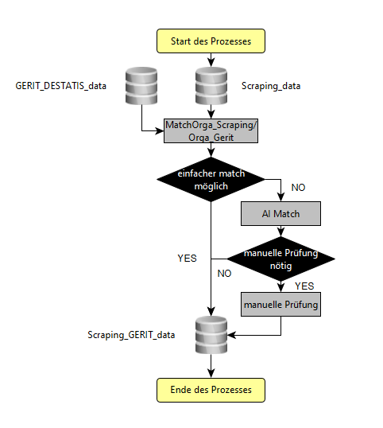
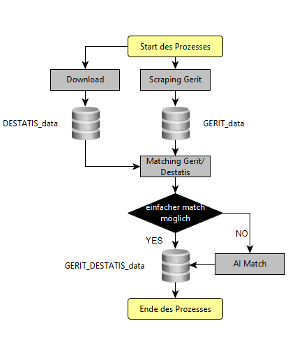

## HEXmatchR [](http://srv-data01:30080/hex/HEXmatchR)

## Installation

`HEXmatchR` kann folgendermaßen installiert werde:

``` r

remotes::install_git("http://srv-data01:30080/hex/hex-gerit/HEXmatchR")
```

## Was macht HEXmatchR?

HEXmatchR spielt über die Variable `Organisation` GERIT-Daten an den
HEX. Diese erlauben es wiederum, HEX-Daten mit DESTATIS-Daten (z.B.
Personal und Studierendenzahlen) anzureichern.

## Wie funktioniert HEXmatchR

## In an Nutshell

todo!



hex_match_short

## Detaillierter Ablauf

todo!


hex_match_detail

## Dependencies

Damit HEXmatchR funktioniert, bedarf es einerseits der Daten von
[GERIT](https://www.gerit.org/de/) als auch der von
[DESTATIS](https://erhebungsportal.estatistik.de/Erhebungsportal/informationen/statistik-des-hochschulpersonals-670).

Die GERIT Daten werden derzeit
[gescrapet](http://srv-data01:30080/hex/hex-gerit/hex-scraping-gerit),
die DESTATIS-Daten werden einfach geladen (siehe link oben). Das
Scraping wird zeitnah in das Paket überführt.

Die GERIT- und die DESTATIS-Daten werden durch
`merge_gerit_with_DESTATIS_system.R` zusammengeführt. Dies geschieht
folgendermaßen:



GERIT DESTATIS Match
